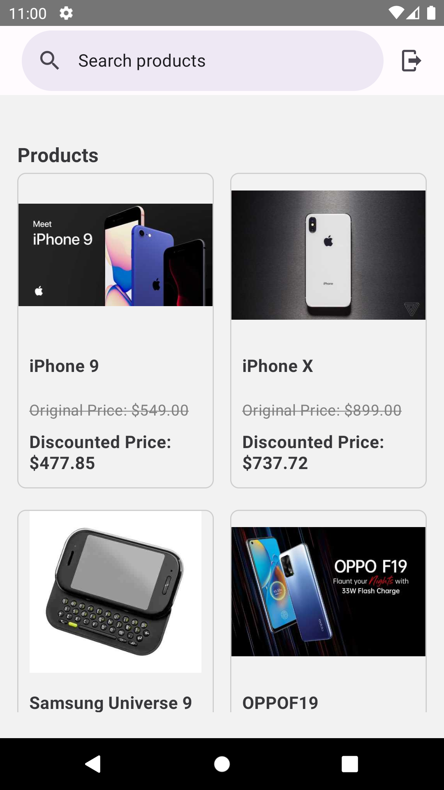

## Overview

This project is a test assignment from Surplus.

### Features

- Uses API from https://dummyjson.com
- Browse and search products
- View detailed product information

## Installation

Follow these steps to install and run the project locally:

1. Clone the repository: `git clone https://github.com/falconilham/Surplus.git`
2. Navigate to the project directory: `cd Surplus`
3. Install the dependencies: `npm install`
4. Install Pod for iOS: `npm run install-ios`
5. Run on iOS: `npm run ios`
6. Run on Android: `npm run android`
7. Use the following credentials for login:
   - Username: `kminchelle`
   - Password: `0lelplR`

## Technologies Used

- React Native
- Redux for state management
- React Navigation for app navigation
- Axios for making API requests
- React Native Paper for UI Library
- React Hook Form for handling forms

## Structure

SurplusApp/
├── src/
│   ├── components/              # Reusable components
│   ├── navigation/              # Navigation configuration
│   ├── services/                # API services and integrations
│   ├── redux/                   # Redux store configuration
│   └── index.js                 # Entry point of the application
├── .gitignore
├── package.json
├── README.md
└── ...                          # Other project files and folders

## Development

During development, the project was tested on iPhone 14 (iOS 16.4) and Android 11.

## Preview

## Preview

Here are the preview screenshots of the application:

